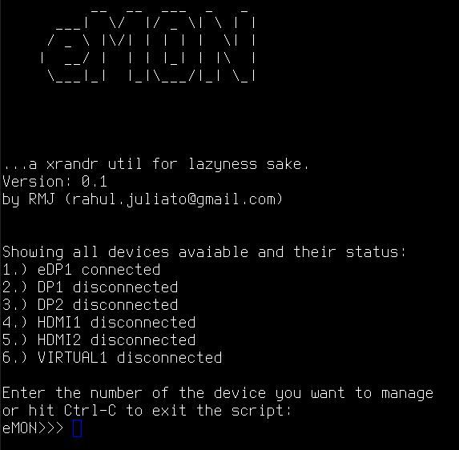
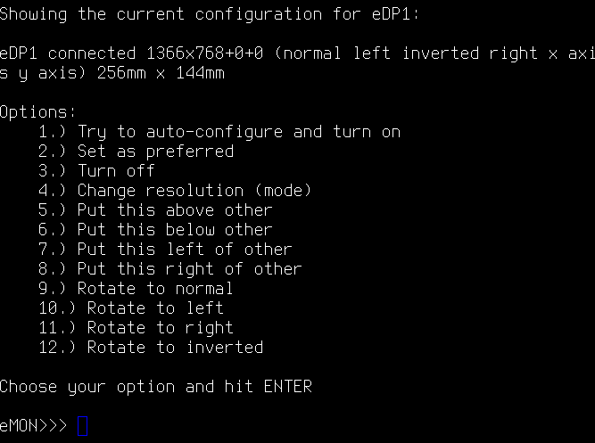

eMON
----

This is a interactive cli bash script for xrandr (Xorg) in *nix world and it does some of basic functions of setting up screens on monitors.

You can:
- Position your screen LEFT, RIGHT, ABOVE and BELOW, other screen.
- Set as preferred
- Change resolution (mode)
- Rotate
- Turn off/on
- Use auto-configure

Execute emon.sh with bash.

Screenshots
----------

